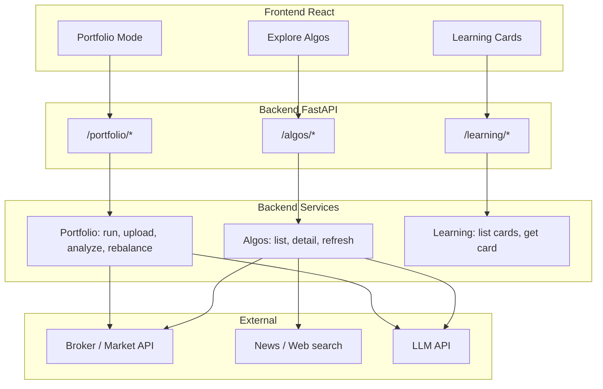

# Design (Detailed)

Technical design derived from the plan and requirements. Covers architecture, backend/frontend structure, APIs, data models, and key flows.

---

## 1. System Architecture

### 1.1 Top-Level Layout

```
SmartAlgoTrading/
├── backend/          # FastAPI Python application
├── frontend/         # React application
└── docs/             # plan.md, requirements.md, design.md, tasks.md
```

- **backend**: All server-side logic, broker/market data client (Dhan initially), algos, portfolio analysis, rebalancing, LLM integration, learning content.
- **frontend**: SPA (React) consuming backend REST API; three main flows: Portfolio Mode, Explore algos, Learning cards.
- **docs**: Single source of truth for plan, requirements, design, and tasks.

### 1.2 High-Level Data Flow



### 1.3 Three Flows Summary

| Flow  | Frontend route/section | Backend routers      | Main operations                          |
|-------|------------------------|----------------------|------------------------------------------|
| Flow 1 | Portfolio / Investment | `/portfolio/*`       | investment (multi-asset), allocation, rebalance; run, upload, analyze (stocks path / deep-dive) |
| Flow 2 | Explore algos          | `/algos/*`           | list (by segment), detail, refresh       |
| Flow 3 | Learning               | `/learning/*`        | list cards, get card by id               |

**Investment-level**: User can provide portfolio across asset classes (equity, debt, mutual_fund, gold, cash); system returns allocation by asset class; rebalancing at asset-class level; **deep-dive: stocks** (equity slice) uses existing run/upload/analyze flows. See [investment-level-plan.md](investment-level-plan.md).

---

## 2. Backend Design (FastAPI)

### 2.1 Technology Stack

- **Runtime**: Python 3.12; virtual env at `backend/.venv` (recommended). See [setup.md](setup.md) for full details.
- **Framework**: FastAPI
- **HTTP**: REST; JSON request/response
- **Broker / market data**: Provider-agnostic interface; first implementation: Dhan (official `dhanhq` client).
- **News**: HTTP client + Serper/Google/Bing API (or similar)
- **LLM**: OpenAI SDK or Anthropic/local HTTP client; structured output (JSON)
- **Config**: **Secrets** (broker tokens, API keys) in **env only**. **Non-secret options** (e.g. `broker.provider`) in global `backend/config/config.yaml`; optional YAML for watchlists, algo metadata (`config/algos.yaml`).
- **Agents**: AGNO framework (Agno) for LLM agents; Pydantic for structured JSON response design; BaseAgent pattern with global config and per-agent override (see §2.2.1).

### 2.2.1 AGNO framework, BaseAgent pattern, and agent layout

The backend uses the **AGNO framework** (Agno) for AI/LLM agents and **Pydantic** for a consistent **JSON response design pattern**. Agent layout and configuration follow the rules below.

**AGNO framework**

- Use **AGNO** (Agno) for building and running agents (e.g. scoring agent, feedback agent, per-algo agents). AGNO provides agents, tools, and structured outputs; we use it for model calls, tool orchestration, and response shaping.
- All agent responses that must be consumed by the app (e.g. confidence + suggestion, feedback summary) use **Pydantic** models as the **structured output schema**: define a response model (e.g. `AlgoScoringResponse` with `confidence`, `suggestion`, `reasoning`), and have the agent return JSON that conforms to that model for validation and type safety.

**BaseAgent and config**

- **BaseAgent**: A single base agent class (or factory) that:
  - Accepts **global config** (model provider, model name, API keys, default temperature, etc.) from a central **config module**.
  - Applies **overrides** when building each agent: overrides can come from a per-agent **config.yaml** and/or from a central **agent registry** in the global config (see below). Per-agent overrides take precedence over global when both exist.
- **Config module**: Configuration is kept in a **dedicated config module** (e.g. `app/config/` or `app/agents/config.py`), separate from business logic. It exposes:
  - **Global agent config**: default model id, provider, temperature, max_tokens, etc., used by BaseAgent when no override is set.
  - **Optional central agent overrides**: in the same global file (or a dedicated `agents.yaml`), a section that lists **agent name** and **override params** (model, temperature, etc.) per agent. Use this when you want one place to see and edit all agent settings.
  - **App-level settings**: env-based (API keys, broker e.g. Dhan, feature flags) and optional YAML (watchlists, algo metadata).

**Where overrides live (model, temperature, etc.)**

- **Option A — Per-agent only**: Each agent folder has a **config.yaml** with that agent’s override params (model, temperature, max_tokens, etc.). Global config supplies only defaults; no central list of agent overrides. Keeps each agent self-contained.
- **Option B — Global only**: No per-agent config.yaml for overrides. The **global config file** has a section (e.g. `agents: { scoring_agent: { model: "...", temperature: 0.2 }, feedback_agent: { ... } }`) listing each agent name and its override params. Single place to manage all agents.
- **Recommended — Hybrid**: **Global config** holds defaults and optionally a central **agent registry** (agent_name → override params). **Per-agent config.yaml** may override those (model, temperature, etc.) for that agent. **Resolution order**: global defaults → central agent overrides (if present) → per-agent config.yaml (if present); later wins. So you can use only global, only per-agent, or both; per-agent overrides take precedence when both exist.

**Redesign: prompts from .md, other info from config.yaml**

- **Prompts (system instructions)** are stored in **.md** files per agent (e.g. `system_instructions.md` or `prompt.md` in the agent folder). Written in Markdown for the LLM to understand; can be static or a template with placeholders (e.g. `{{symbol}}`, `{{technical_summary}}`, `{{suggestion_enum}}`).
- **All other agent-specific settings** (model, temperature, max_tokens, overrides, and params used when constructing the prompt) live in **agent-specific config.yaml** only. No prompt text in YAML.

**Per-agent folder layout**

- **Each agent** has its own folder (e.g. `app/agents/<agent_name>/`).
- Inside that folder:
  - **One or more .md files** for prompts: e.g. `system_instructions.md` (main system prompt). Optionally `user_prompt_template.md` or other prompt files if needed. Content is for the LLM; can be templated with placeholders.
  - **config.yaml**: agent-specific **non-prompt** config only — model, temperature, max_tokens, overrides, and any params that are injected into the prompt template (e.g. `suggestion_enum`, `confidence_range`, algo-specific keys). No `system_instructions` key; prompts live in .md.

**Loading and constructing the prompt**

- The agent (or BaseAgent) loads **system instructions** from the agent’s **.md** file(s), and **other settings** from the agent’s **config.yaml**.
- If the .md content has **placeholders** (e.g. `{{symbol}}`, `{{suggestion_enum}}`), the agent **constructs** the final prompt at runtime by substituting:
  - **From config.yaml**: e.g. `suggestion_enum`, `confidence_range`, and any other keys defined there.
  - **From runtime**: e.g. `symbol`, `technical_summary`, `news_summary`, algo name (passed when the agent is invoked).
- The **constructed** string is sent to the LLM as the system prompt. All agent responses that are part of the API contract use **Pydantic** for validation.

**Why .md for prompts**

- **.md** gives native Markdown editing, good readability for the LLM, and no YAML escaping. Prompts can be long and structured (headers, lists, code blocks). **config.yaml** stays focused on structured data (model, temperature, enums, ranges) and is not used for prompt text.

**Example layout (prompts from .md, other from config.yaml)**

```
backend/app/
├── config/                         # Config module (global settings, global agent defaults)
│   ├── __init__.py
│   ├── settings.py
│   ├── global_agent_config.yaml
│   └── ...
├── agents/
│   ├── base_agent.py                # BaseAgent: loads .md + config.yaml per agent
│   ├── scoring_agent/
│   │   ├── system_instructions.md   # Prompt (Markdown, optional placeholders)
│   │   └── config.yaml              # model, temperature, suggestion_enum, etc. (no prompt text)
│   ├── feedback_agent/
│   │   ├── system_instructions.md
│   │   └── config.yaml
│   └── ...
└── models/
    ├── responses.py
    └── ...
```

**Example: system_instructions.md (prompt, for LLM)**

```markdown
# Scoring agent for algo trading

You are a scoring agent. Given technical and news context for a symbol, output a JSON with:
- `confidence` (0–100)
- `suggestion` (one of: {{suggestion_enum}})
- `reasoning` (short explanation)

## Context

- **Symbol**: {{symbol}}
- **Technical summary**: {{technical_summary}}
- **News/sentiment**: {{news_summary}}

## Output

Return valid JSON only. Confidence range: {{confidence_range}}.
```

**Example: config.yaml (agent-specific, no prompt text)**

```yaml
# Model and runtime overrides (else from global)
model: "gpt-4o-mini"
temperature: 0.2
max_tokens: 1024

# Params used when constructing the prompt from .md (injected into placeholders)
suggestion_enum: ["Strong Buy", "Buy", "Hold", "Sell", "Strong Sell"]
confidence_range: [0, 100]
```

At runtime the agent loads `system_instructions.md`, reads `suggestion_enum` and `confidence_range` from `config.yaml`, receives `symbol`, `technical_summary`, `news_summary` from the caller, substitutes all into the .md template, and sends the **constructed** string to the LLM.

**Design rules (summary)**

1. **AGNO** for agent runtime; **Pydantic** for all JSON response schemas (API and agent structured output).
2. **BaseAgent** receives **global config** from the **config module**; overrides and agent params from **per-agent config.yaml** (and optionally central agent registry); per-agent wins.
3. **Config module** is separate from agents; holds global app settings and global agent defaults.
4. **Prompts** come from **.md** files per agent (e.g. `system_instructions.md`); **other info** (model, temperature, enums, ranges, overrides) from **agent-specific config.yaml** only.
5. When the .md prompt contains placeholders, the **agent constructs** the final prompt by substituting values from **config.yaml** and from **runtime** before calling the LLM.

### 2.2 Directory Structure (Backend)

```
backend/
├── app/
│   ├── main.py              # FastAPI app, CORS, router includes
│   ├── config.py            # Settings (env, defaults)
│   ├── api/
│   │   ├── portfolio.py     # POST /portfolio/run, /upload; GET/POST /portfolio/rebalance, /last-run
│   │   ├── algos.py         # GET /algos, /algos/{id}, POST /algos/{id}/refresh
│   │   └── learning.py     # GET /learning/cards, /learning/cards/{id}
│   ├── services/
│   │   ├── portfolio/       # run_algos, parse_upload, analyze, rebalance
│   │   ├── algos/          # list_algos, get_algo_detail, refresh_algo
│   │   └── learning/       # list_cards, get_card
│   ├── data/               # Broker factory (get_broker_client), base protocol, Dhan implementation
│   ├── analysis/           # technical indicators, sentiment, aggregator for LLM
│   ├── algos/               # option_selling, momentum, value, mean_reversion, breakout
│   ├── llm/                 # prompt templates, client, response parser (may use agents)
│   ├── sizing/              # position sizing from portfolio and risk rules
│   ├── models/              # Pydantic request/response models + agent response schemas
│   ├── config/              # Config module: global settings, global_agent_config (for BaseAgent)
│   └── agents/              # AGNO agents: BaseAgent + one folder per agent
│       ├── base_agent.py    # BaseAgent: loads .md (prompts) + config.yaml (other) per agent
│       ├── scoring_agent/   # system_instructions.md + config.yaml
│       ├── feedback_agent/  # system_instructions.md + config.yaml
│       └── ...
├── config/                  # watchlists, algo metadata, learning content (JSON/md)
├── requirements.txt
└── README.md
```

### 2.3 API Specification (Contract)

#### Portfolio / Investment

| Method | Endpoint | Request | Response |
|--------|----------|---------|----------|
| POST   | `/portfolio/investment` (or extended upload) | `{ "segments": [{ "asset_class", "value"?, "holdings"?: [] }] }` or multipart multi-asset file | `{ "total_value", "allocation": [{ "asset_class", "value", "pct" }], "feedback"? }` |
| POST   | `/portfolio/run` | `{ "amount": number, "algo_ids"?: string[], "allocation"?: Record<string, number> }` (amount may be equity slice from investment) | `{ "results": [{ "symbol", "name", "suggestion", "confidence", "suggested_quantity"?, "suggested_amount"?, "last_price" }] }` |
| GET    | `/portfolio/last-run` | - | Same as run result or 404 |
| POST   | `/portfolio/upload` | multipart file: stocks-only (symbol, quantity, …) or multi-asset (asset_class/type + value or holdings) | `{ "total_value", "holdings"?, "segments"?, "allocation"?, "feedback": { "summary", "suggestions", "analysis_html"? }, "sector_mix"?, "concentration" }` — `analysis_html`: LLM-generated dashboard HTML (equity-research style); see [llm-portfolio-dashboard.md](llm-portfolio-dashboard.md). |
| POST   | `/portfolio/rebalance` | `{ "holdings": [{ "symbol", "quantity", "avg_cost"?, "value"? }], "target_allocation"?: Record<symbol, weight>, "strategy"?: "full"\|"bands", "band_pct"?: number }` — omit target for equal-weight. | `{ "current_weights", "target_weights", "trades": [{ "symbol", "action": "buy"\|"sell", "quantity"?, "amount" }] }` (stock-level; asset-class in Phase 3B) |

#### Explore Algos

| Method | Endpoint | Request | Response |
|--------|----------|---------|----------|
| GET    | `/algos` | Query: `segment=stocks|fno` | `{ "algos": [{ "id", "name", "segment", "short_description" }] }` |
| GET    | `/algos/{algo_id}` | - | `{ "overview": { "goal", "inputs", "signals", "risk" }, "stocks": [{ "symbol", "name", "suggestion", "confidence", "last_price" }] }` |
| POST   | `/algos/{algo_id}/refresh` | optional body (e.g. watchlist override) | Same stocks array as detail |

#### Learning Cards

| Method | Endpoint | Request | Response |
|--------|----------|---------|----------|
| GET    | `/learning/cards` | Query: `category` (optional) | `{ "cards": [{ "id", "title", "category", "short_description" }] }` |
| GET    | `/learning/cards/{id}` | - | `{ "id", "title", "category", "body", "image_url"?, "link"? }` |

### 2.4 Key Backend Modules

- **Investment portfolio**: Accept multi-asset input (segments: asset_class + value/holdings) or multi-asset upload; return total value and allocation by asset_class (equity, debt, mutual_fund, gold, cash). Used for high-level view and as context for rebalancing and stocks deep-dive.
- **Portfolio run**: Load config (watchlists per algo); for each selected algo, fetch data (broker OHLC/options, e.g. Dhan), run technical + optional news/LLM, get confidence + suggestion; apply sizing from amount and allocation; return aggregated results. Amount may be equity slice from investment view.
- **Portfolio upload**: Parse CSV/Excel → stocks-only (holdings) or multi-asset (rows with asset_class/type and value or holdings); optionally resolve symbol to name/sector; compute total value, sector mix, concentration; build feedback; return. Multi-asset upload returns allocation by asset_class.
- **Rebalancing**: Input: current holdings and/or segments (asset-class level). Target allocation at **asset-class** level (e.g. equity 60%, debt 40%) and/or per-sector within equity. Compute current weights; compare to target; bands or calendar; output high-level trades (e.g. "add ₹X to equity") and, when equity holdings provided, stock-level trades (symbol, action, quantity or amount).
- **Algos list/detail**: List: filter by segment from config. Detail: return static overview (from config) + stocks table (from last run or cache; refresh triggers run for that algo only).
- **Learning**: Serve from config (e.g. `config/learning/cards.json` and markdown or HTML bodies); list and get by id.

### 2.5 Broker / Market Data Integration

The system uses a **broker or market data provider** for authentication, market data (LTP, OHLC, options chain), and optionally order placement. The architecture is provider-agnostic; additional providers can be added alongside or instead of the first implementation.

**Backend structure**: A **factory** (`app/data/factory.get_broker_client`) returns the configured broker client based on settings (e.g. `BROKER_PROVIDER=dhan`). All clients implement a common **protocol** (`app/data/base.BrokerClient`): `get_ltp`, `get_ohlc`, `place_order`. The **Dhan implementation** lives in `app/data/dhan_client.DhanBrokerClient` and uses the `dhanhq` package.

**First implementation: Dhan**

- **Auth**: Access token (header) + client_id; token refresh before expiry (e.g. 24h).
- **Market data**: `POST /marketfeed/ltp`, `POST /marketfeed/ohlc`; for F&O, options chain endpoint if available. Map symbol → security_id via config or Dhan reference.
- **Orders**: `place_order()` with security_id, exchange_segment, transaction_type, quantity, order_type, product_type; only when execution is enabled and thresholds met; dry-run mode required first.

### 2.6 Rebalancing Logic (Traditional)

- **Target allocation**: User or config provides target weights. **Asset-class level**: e.g. equity 60%, debt 40% (for investment-level rebalancing). **Stock/sector level**: per holding or per sector within equity (when holdings are provided).
- **Current weights**: From uploaded holdings (value per holding / total value) or from segments (value per asset_class / total value).
- **Full**: Rebalance to exact target weights. **Bands**: If |current_weight - target_weight| > band_pct (e.g. 5%), include in rebalance list only then.
- **Calendar** (future): Rebalance on a schedule (e.g. quarterly); output is same trade list.
- **Output**: **Asset-class**: list of { asset_class, action, amount } (e.g. "add ₹X to equity", "reduce debt by ₹Y"). **Stock-level** (when equity holdings provided): list of { symbol, action: "buy"|"sell", quantity or amount }.

---

## 3. Frontend Design (React)

### 3.1 Technology Stack

- **Runtime**: Node 18+
- **Framework**: React (with hooks)
- **Build**: Vite or Create React App
- **Routing**: React Router
- **HTTP**: fetch or axios to backend base URL (env)
- **UI**: Components for layout, forms, tables, cards; optional UI library (e.g. MUI, Chakra) or custom CSS

### 3.2 Directory Structure (Frontend)

```
frontend/
├── public/
├── src/
│   ├── main.jsx
│   ├── App.jsx
│   ├── api/              # client for backend (portfolio, algos, learning)
│   ├── routes/           # or pages/
│   │   ├── PortfolioMode.jsx
│   │   ├── ExploreAlgos.jsx
│   │   └── Learning.jsx
│   ├── components/
│   │   ├── portfolio/
│   │   │   ├── NewPortfolioForm.jsx
│   │   │   ├── ExistingPortfolioUpload.jsx
│   │   │   ├── AnalysisFeedback.jsx
│   │   │   ├── RebalanceView.jsx
│   │   │   └── RunResultsTable.jsx
│   │   ├── algos/
│   │   │   ├── AlgoCard.jsx
│   │   │   ├── AlgoDetail.jsx
│   │   │   └── StocksTable.jsx
│   │   └── learning/
│   │       ├── LearningCard.jsx
│   │       └── LearningDetail.jsx
│   ├── hooks/
│   └── styles/
├── package.json
└── README.md
```

### 3.3 Routes and Flow Mapping

| Route (example) | Component       | Flow  | Description |
|----------------|-----------------|------|-------------|
| `/`            | Home/Layout     | -    | Nav: Portfolio / Investment, Explore, Learning |
| `/portfolio`   | PortfolioMode   | Flow 1 | Entry: Investment (multi-asset) \| Stocks only (New \| Existing) |
| `/portfolio/investment` | InvestmentInput → AllocationView → RebalanceView (asset-class) → link "Deep-dive: Stocks" | Flow 1 | Multi-asset input/upload, allocation by asset class, rebalance; deep-dive to equity |
| `/portfolio/new` | NewPortfolioForm + RunResultsTable | Flow 1 | Amount (or equity slice), algo selection, run, results |
| `/portfolio/existing` | ExistingPortfolioUpload → AnalysisFeedback → RebalanceView | Flow 1 | Upload stocks (or equity slice), feedback, rebalance |
| `/algos`       | ExploreAlgos    | Flow 2 | Filter Stocks/F&O, AlgoCard grid |
| `/algos/:id`   | AlgoDetail      | Flow 2 | Overview + StocksTable |
| `/learning`    | Learning        | Flow 3 | LearningCard grid, optional category filter |
| `/learning/:id`| LearningDetail  | Flow 3 | Full card content |

### 3.4 Key Components

- **PortfolioMode**: Parent with two sub-flows; state or URL for New vs Existing.
- **NewPortfolioForm**: Input amount (with format hint 1L, 100000); multi-select algos; optional allocation; submit → POST /portfolio/run → show RunResultsTable.
- **ExistingPortfolioUpload**: File input (CSV/Excel); POST /portfolio/upload → show AnalysisFeedback (summary, suggestions); then “Rebalance” → POST /portfolio/rebalance with target config → show RebalanceView (current vs target, suggested trades).
- **AlgoCard**: Display name, segment, short description; link to `/algos/:id`.
- **AlgoDetail**: Fetch GET /algos/:id; render overview (goal, inputs, signals, risk) and StocksTable; optional Refresh button → POST /algos/:id/refresh.
- **StocksTable**: Table of symbol, name, suggestion, confidence, last_price (and for run results: suggested_quantity/amount).
- **LearningCard**: Title, category, short description; link to `/learning/:id`.
- **LearningDetail**: GET /learning/cards/:id; render title, body, optional image/link.
- **RebalanceView**: Table or list: current weight, target weight, difference; list of suggested trades. Supports asset-class level (e.g. "add ₹X to equity") and/or stock-level (symbol, action, quantity/amount).

### 3.5 Environment and API Base URL

- Backend base URL configurable via env (e.g. `VITE_API_URL` or `REACT_APP_API_URL`) so frontend can call `http://localhost:8000` in dev and production URL in prod.

---

## 4. Data Models (Representative)

### 4.1 Portfolio Run Request/Response

- **Run request**: amount (number), algo_ids (string[]), allocation (optional map algo_id → fraction).
- **Run response**: results[] with symbol, name, suggestion, confidence, suggested_quantity or suggested_amount, last_price.

### 4.2 Upload/Feedback Response

- **Stocks-only**: total_value, holdings[] (symbol, quantity, value, sector?), feedback { summary, suggestions }, sector_mix (optional), concentration (optional).
- **Investment / multi-asset**: total_value, segments[] { asset_class, value, holdings? }, allocation[] { asset_class, value, pct }, feedback (optional).

### 4.3 Rebalance Request/Response

- **Request**: holdings[] (symbol, quantity, value) and/or segments[] (asset_class, value); target_allocation { asset_class or symbol: weight }; strategy + band_pct (optional).
- **Response**: current_weights, target_weights, trades[] { symbol?, asset_class?, action, quantity?, amount? } — asset-class-level and/or stock-level trades.

### 4.4 Algo List and Detail

- **List**: id, name, segment (stocks|fno), short_description.
- **Detail**: overview { goal, inputs, signals, risk }, stocks[] { symbol, name, suggestion, confidence, last_price }.

### 4.5 Learning Card

- **List**: id, title, category, short_description.
- **Detail**: id, title, category, body (HTML or markdown), image_url, link.

---

## 5. Security and Config

- **Secrets**: Broker access token and client_id (e.g. Dhan), LLM API key, news API key in **environment variables (or .env) only**; never in config.yaml. Non-secret broker/app options live in `backend/config/config.yaml`.
- **CORS**: Backend allows frontend origin (e.g. localhost:5173 in dev).
- **Validation**: All request bodies validated with Pydantic; return 422 with details on validation error.
- **Errors**: Consistent format { errorType, errorCode, errorMessage } and appropriate HTTP status (4xx, 5xx).

---

## 6. Optional Execution Path

- **Execution module**: Reads run results (suggestion, confidence); if confidence >= threshold and action in [Buy, Strong Buy] (or Sell for short), compute quantity from sizing; call broker place_order (e.g. Dhan).
- **Dry-run**: Log order payload instead of sending; config flag to switch to live.
- **Rate limits**: Respect broker/provider order limits (e.g. Dhan: 10/sec); queue if needed.
